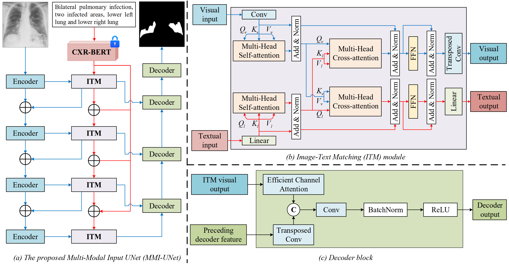

# Pytorch implementation of MMI-UNet - MICCAI2024
**Visual-Textual Matching Attention for Lesion Segmentation in Chest Images**

[MICCAI 2024 - Early Acceptance-Top 11%](https://link.springer.com/chapter/10.1007/978-3-031-72114-4_67)

## Framework



## Requirements
1. Environment: The main mandatory dependency versions are as follows:  
    ```
    python=3.10.15  
    torch=2.5.0+cu12.1  
    torchvision=0.13.1  
    pytorch_lightning=1.9.0  
    torchmetrics=0.10.3  
    transformers=4.24.0  
    monai=1.0.1  
    pandas  
    einops  
    ```

2. (Option) Download the pretrained model of CXR-BERT and ConvNeXt
   
   CXR-BERT-specialized see: https://huggingface.co/microsoft/BiomedVLP-CXR-BERT-specialized/tree/main  
   ConvNeXt-tiny see: https://huggingface.co/facebook/convnext-tiny-224/tree/main

   Download the file ``pytorch_model.bin`` to ```./lib/BiomedVLP-CXR-BERT-specialized/``` and ```./lib/convnext-tiny-224```

   Or just use these models online:
   ```
   url = "microsoft/BiomedVLP-CXR-BERT-specialized"
   tokenizer = AutoTokenizer.from_pretrained(url,trust_remote_code=True)
   model = AutoModel.from_pretrained(url, trust_remote_code=True)
   ```
   

## Dataset
1. QaTa-COV19 Dataset (images & segmentation mask)  
    [QaTa-COV19 Dataset on Kaggle](https://www.kaggle.com/datasets/aysendegerli/qatacov19-dataset)

    **We use QaTa-COV19-v2 in our experiments.**

2. QaTa-COV19 Text Annotations (from thrid party)  
    Check out the related content in [LViT-TMI'23](https://github.com/HUANGLIZI/LViT)

    **Thanks to Li et al. for their contributions. If you use this dataset, please cite their work.**

## QuickStart
Our training is implemented based on PyTorch Lightning. 

Please check the relevant training settings in train.py and config.  

For example:
```train_csv_path:./data/QaTa-COV19-v2/prompt/train.csv```

To train a model, please execute:  
```python train.py```  
To evaluate a model, please excute:  
```python evaluate.py```

We release our checkpoints at this [Google Drive link](https://drive.google.com/drive/u/1/folders/1r_8vSw1SRZXlR6O5XOwBMfbwVvFFEmlw)
## Citation

If you find our work useful in your research, please consider citing:
```
@inproceedings{bui2024visual,
  title={Visual-Textual Matching Attention for Lesion Segmentation in Chest Images},
  author={Bui, Phuoc-Nguyen and Le, Duc-Tai and Choo, Hyunseung},
  booktitle={International Conference on Medical Image Computing and Computer-Assisted Intervention},
  pages={702--711},
  year={2024},
  organization={Springer}
}
```
## Acknowledgements
MMI-UNet is built based on [GuideDecoder](https://github.com/Junelin2333/LanGuideMedSeg-MICCAI2023). We thank their authors for making the source code publicly available.
